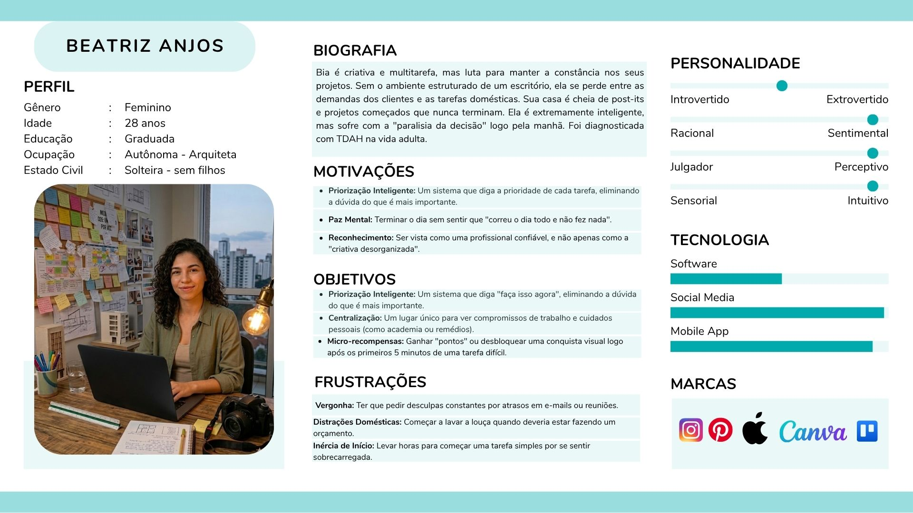
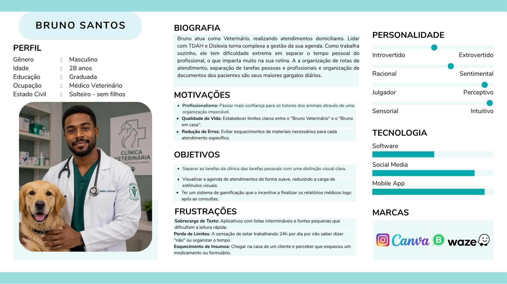
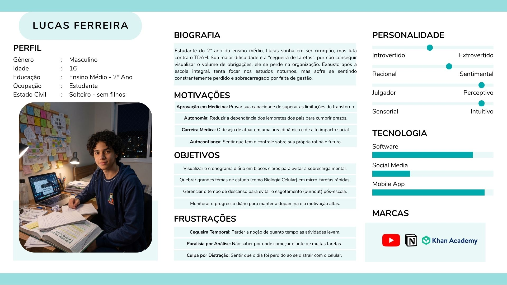
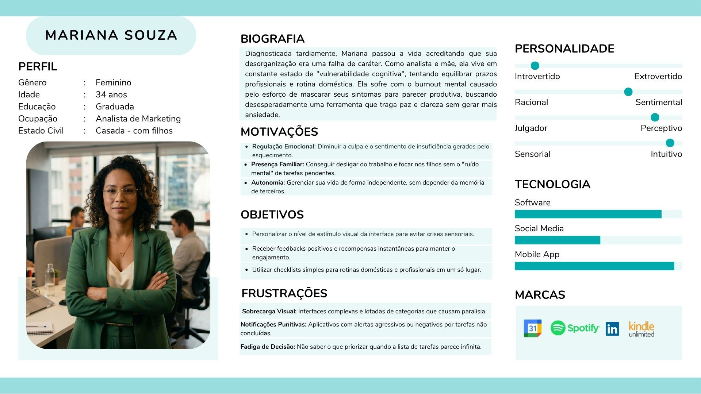
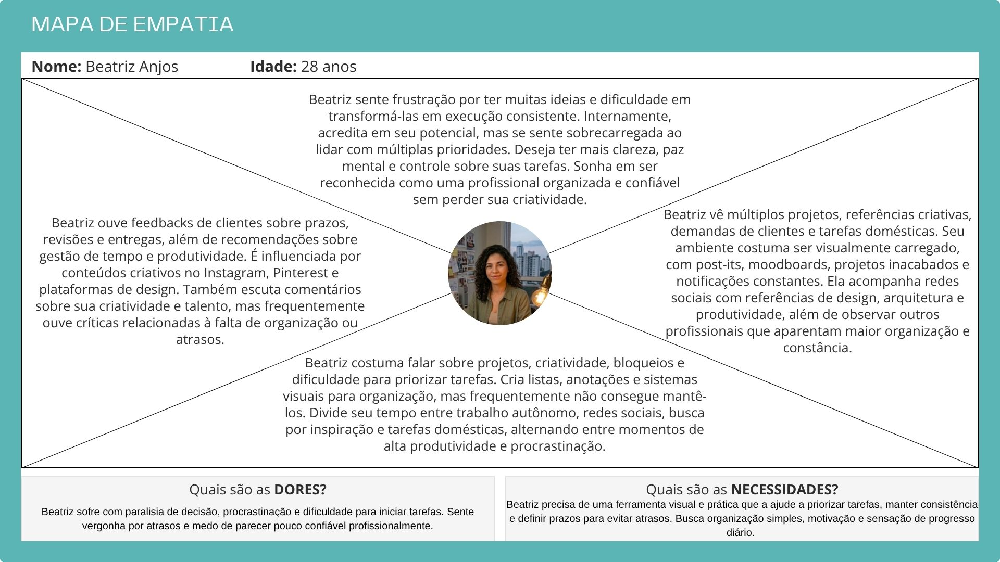
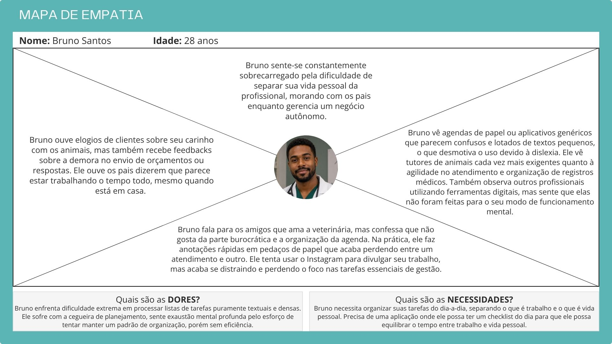
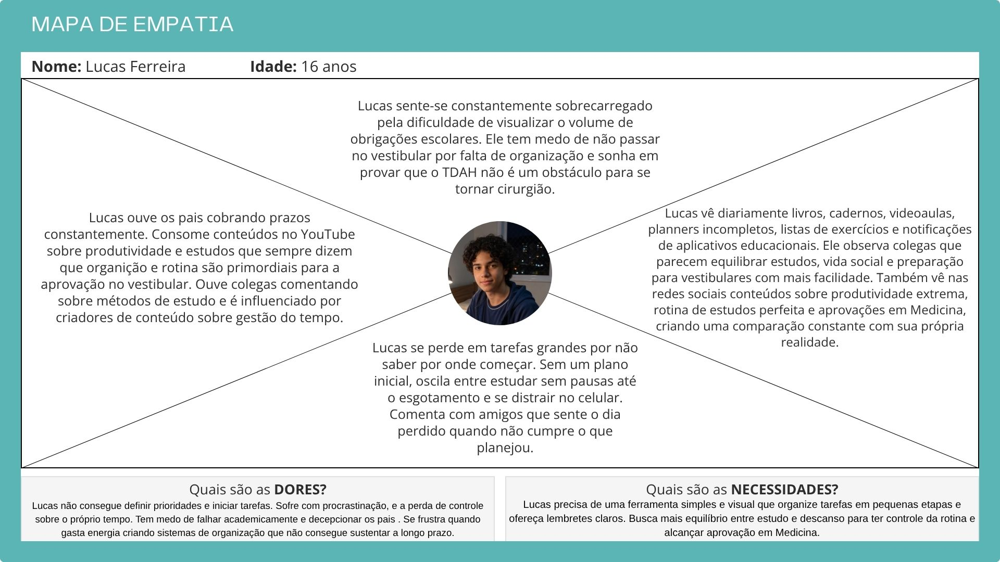
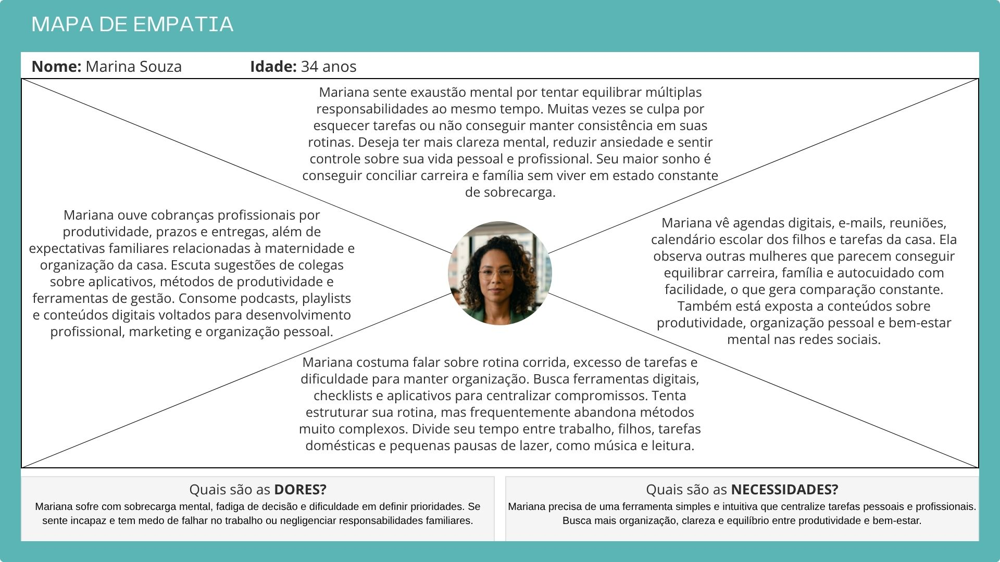

# 4. PROJETO DO DESIGN DE INTERAÇÃO

## 4.1 Personas

## 4.2 Mapa de Empatia

## 4.3 Protótipos das Interfaces
Apresente nesta seção os protótipos de alta fidelidade do sistema proposto. A fidelidade do protótipo refere-se ao nível de detalhes e funcionalidades incorporadas a ele. Assim, um protótipo de alta fidelidade é uma representação interativa do produto, baseada no computador ou em dispositivos móveis. Esse protótipo já apresenta maior semelhança com o design final em termos de detalhes e funcionalidades. No desenvolvimento dos protótipos, devem ser considerados os princípios gestálticos, as recomendações ergonômicas e as regras de design (como as 8 regras de ouro). É importante descrever no texto do relatório como os princípios gestálticos e as regras de ouro foram seguidas no projeto das interfaces. Nesta etapa deve-se dar uma ênfase na implementação do software de modo que possam ser realizados os testes com usuários na etapa seguinte.

## Tela de To-Do List

### Objetivo da Tela
A tela inicial tem como objetivo centralizar o gerenciamento das tarefas diárias do usuário, permitindo visualizar compromissos, acompanhar o progresso do dia e acessar rapidamente as principais funcionalidades da aplicação de forma simples e organizada.

### Princípios Gestálticos
- **Proximidade:** Os elementos relacionados estão agrupados visualmente de forma adequada. O card da tarefa reúne horário, título e ação de exclusão, facilitando a compreensão do usuário sobre a relação entre essas informações.
- **Similaridade:** Os itens do menu lateral possuem padronização de ícones, tipografia e espaçamento, permitindo rápida identificação da navegação. Os cards seguem o mesmo estilo visual, reforçando consistência.
- **Continuidade:** O alinhamento vertical dos componentes principais conduz naturalmente o olhar do usuário do calendário até as tarefas e posteriormente para o botão de criação de nova tarefa.
- **Fechamento:** Os cards e containers possuem bordas arredondadas e delimitações claras, permitindo que o usuário identifique facilmente cada seção da interface mesmo sem contornos muito fortes.
- **Figura-Fundo:** A aplicação utiliza um fundo claro e elementos brancos nos cards e containers, criando contraste suficiente para destacar informações importantes como tarefas e botões de ação.

### Regras de Ouro de Shneiderman
- **Consistência:** A interface mantém padrão visual nos menus, botões, ícones e tipografia, tornando a navegação mais intuitiva e previsível.
- **Feedback Informativo:** O menu ativo possui destaque visual e os botões apresentam diferenciação visual adequada, ajudando o usuário a identificar ações disponíveis.
- **Redução da Sobrecarga de Memória:** A navegação simples e objetiva reduz a necessidade de o usuário memorizar comandos ou caminhos complexos dentro da aplicação.
- **Reversão de Ações:** A exclusão de tarefas está disponível de forma rápida através do ícone de lixeira. Como melhoria, recomenda-se adicionar confirmação ou opção de desfazer exclusão.

### Recomendações Ergonômicas
- **Carga de Trabalho:** A interface apresenta design minimalista e poucos elementos simultâneos na tela, reduzindo esforço cognitivo e distrações.
- **Condução:** Os componentes estão organizados de maneira clara, permitindo que o usuário compreenda facilmente o fluxo principal da aplicação.
- **Controle do Usuário:** O usuário possui liberdade para navegar entre as seções e gerenciar suas tarefas de forma simples e direta.
- **Consistência:** Há padronização visual entre menus, cards, botões e cores, contribuindo para melhor aprendizado e usabilidade da interface.

## Tela de Timer 

### Objetivo da Tela
A tela proporciona ao usuário uma forma visual e interativa de acompanhar períodos de concentração, auxiliando no gerenciamento do tempo durante atividades de estudo, trabalho ou produtividade. A interface foi desenvolvida para ser simples e intuitiva, com controles claros e acompanhamento contínuo do progresso da contagem do tempo.

### Princípios Gestálticos 
- **Proximidade:** O timer, o anel de progresso e os botões de controle estão agrupados em um card centralizado, deixando claro que pertencem ao mesmo conjunto funcional.
- **Similaridade:** Os botões seguem o mesmo formato e tipografia, diferenciando apenas na cor para indicar a função de cada um, tornando as ações facilmente identificáveis.
- **Continuidade:** O anel animado acompanha o avanço do tempo de forma fluida, reforçando a percepção do tempo em andamento.
- **Fechamento:** Mesmo parcialmente preenchido, o anel é percebido como um círculo completo, permitindo a leitura do progresso de forma imediata e natural.
- **Figura-Fundo:** O contraste entre o fundo degradê e o card central destaca os elementos interativos, facilitando a identificação das informações principais.

### Regras de Ouro de Shneiderman
- **Consistência:** Os elementos da interface seguem um mesmo padrão visual de cores, formatos e organização, reduzindo o esforço cognitivo do usuário.
- **Feedback Informativo:** O anel de progresso, as mudanças nos botões e a mensagem ao final da contagem do tempo fornecem respostas visuais contínuas durante toda a utilização.
- **Redução da Sobrecarga de Memória:** A interface apresenta apenas os elementos essenciais, evitando distrações e mantendo o foco do usuário na tarefa principal.
- **Reversão de Ações:** Os botões Pausar e Reiniciar permitem que o usuário interrompa ou restaure o timer a qualquer momento, oferecendo controle e liberdade durante o uso.

### Recomendações Ergonômicas
- **Carga de Trabalho:** Poucos elementos visuais e informações objetivas reduzem distrações e facilitam a concentração durante o uso.
- **Condução:** A organização hierárquica dos elementos, título, anel e botões, direciona o olhar do usuário de forma natural, sem necessidade de instruções adicionais.
- **Controle do Usuário:** O usuário possui liberdade para iniciar, pausar e reiniciar o timer conforme sua necessidade, permitindo maior flexibilidade durante os períodos de foco.
- **Consistência:** Os estados de interação dos botões e elementos seguem um padrão uniforme, tornando a navegação previsível e intuitiva.

## Tela de Perfil

### Objetivo da Tela
A tela de perfil tem como objetivo permitir que o usuário visualize suas informações pessoais, acompanhe seu desempenho dentro da aplicação e monitore sua evolução por meio de métricas de consistência e pontuação. A interface centraliza dados relevantes de progresso e incentiva a continuidade no uso do aplicativo através de elementos visuais motivacionais.

### Princípios Gestálticos
- **Proximidade:** As informações relacionadas estão agrupadas em blocos visuais bem definidos. A foto de perfil e nome aparecem juntos, enquanto sequência diária e pontuação estão organizadas em cards separados, facilitando a leitura e compreensão rápida.
- **Similaridade:** Os elementos de progresso utilizam o mesmo padrão visual, com cards brancos, bordas arredondadas, barras de progresso e tipografia padronizada. O menu lateral também mantém consistência entre ícones, textos e espaçamentos.
- **Continuidade:** A disposição vertical da interface conduz naturalmente o olhar do usuário da imagem de perfil para o nome e, em seguida, para as conquistas e barras de progresso, criando fluxo visual intuitivo.
- **Fechamento:** Os containers possuem delimitações claras através de formas arredondadas e contraste suave, permitindo ao usuário identificar facilmente cada área funcional da tela.
- **Figura-Fundo:** O fundo em tom claro e suave contrasta com cards brancos e elementos coloridos, destacando informações importantes como sequência diária, pontos e progresso das conquistas.
  
### Regras de Ouro de Shneiderman
- **Consistência:** A interface mantém padronização visual em menus, cards, ícones, cores e tipografia, tornando a navegação previsível e intuitiva.
- **Feedback Informativo:** O item ativo no menu lateral recebe destaque visual, permitindo ao usuário identificar rapidamente sua localização atual dentro da aplicação. As barras de progresso também fornecem retorno imediato sobre evolução.
- **Redução da Sobrecarga de Memória:** As informações essenciais são apresentadas de forma clara e resumida, evitando excesso de dados e reduzindo esforço cognitivo, especialmente importante para usuários com TDAH.
- **Controle do Usuário:** O usuário pode editar foto e nome através dos ícones de edição, garantindo autonomia para personalizar suas informações.
- **Prevenção de Erros:** Os botões de edição estão isolados e visualmente identificáveis, reduzindo chances de ações incorretas ou cliques acidentais.

### Recomendações Ergonômicas
- **Carga de Trabalho:** A interface apresenta poucos elementos simultâneos e organização limpa, reduzindo distrações e facilitando foco nas informações principais.
- **Condução:** O layout hierárquico organiza primeiro identificação pessoal, depois métricas rápidas e por fim conquistas detalhadas, facilitando entendimento do fluxo.
- **Controle do Usuário:** A navegação lateral permite acesso rápido às demais funcionalidades da aplicação, oferecendo liberdade de movimentação.
- **Compatibilidade:** O uso de elementos gamificados, como sequência diária, pontuação e medalhas de conquista, está alinhado ao objetivo do aplicativo de estimular organização e motivação contínua em pessoas com TDAH.

  

## 4.4 Testes com Protótipos
**1.** Ao acessar a página inicial, você conseguiu entender rapidamente qual é o propósito ou objetivo principal do site?

**2.** O menu e os botões estavam posicionados de forma intuitiva?	

**3.** A nomenclatura das seções (menus, botões, links) fez sentido para você?

**4.** Você conseguiu encontrar facilmente as seções ou informações que procurava no protótipo?

**5.** As etapas apresentadas para realizar as tarefas estavam claras e seguiam uma lógica compreensível?

**6.** Os elementos visuais (cores, ícones e disposição dos botões) facilitaram a identificação do que era clicável e do que era apenas informativo?

**7.** Há elementos visuais que chamam atenção indevidamente ou confundem?

**8.** Os textos e rótulos utilizados nas páginas estavam claros e ajudaram a entender as ações que você podia realizar?

**9.** Houve algum elemento difícil de visualizar, clicar ou compreender durante a navegação (por tamanho, contraste ou formato)?

**10.** O texto das instruções, rótulos e mensagens é claro e compreensível?

**11.** Encontrou termos técnicos ou expressões confusas?

**12.** Você se sentiu confiante e satisfeito ao interagir com o protótipo, sem necessidade de ajuda externa?

**13.** O que você mais gostou na interface?

**14.** O que você mudaria ou melhoraria?

**15.** Tem algo mais que gostaria de comentar sobre os protótipos?
### Tela: To-Do list

| Pergunta | Resultado |Observação |
|---|---|---|
| 1 |  Sim | Ao acessar a página inicial consegui entender rapidamente que o objetivo do site é organizar tarefas e acompanhar o progresso diário de produtividade |
| 2 |  Sim | O menu lateral e os botões estão posicionados de forma intuitiva e facilitam bastante a navegação entre as seções |
| 3 |  Sim | Os nomes das seções como “Calendário”, “Progresso” e “Modo Foco” são claros e fazem sentido dentro da proposta da aplicação |
| 4 |  Sim | Foi fácil localizar as principais funcionalidades e entender onde acessar cada área do sistema |
| 5 |  Sim | A interface apresenta um fluxo simples e organizado, deixando claro como visualizar e adicionar tarefas |
| 6 |  Sim | As cores, ícones e disposição dos elementos ajudam a identificar o que pode ser clicado e o que é apenas informativo |
| 7 |  Não | Os elementos visuais estão equilibrados e não há excesso de informações chamando atenção desnecessariamente |
| 8 |  Sim | Os textos e rótulos utilizados são objetivos e ajudam a entender rapidamente as ações disponíveis |
| 9 |  - | O único ponto um pouco difícil foi perceber alguns textos menores e ícones com pouco contraste em relação ao fundo claro da interface |
| 10 |  Sim | As instruções e textos apresentados são simples, claros e fáceis de compreender |
| 11 |  Não | Não encontrei termos técnicos confusos durante a navegação |
| 12 |  Sim | Consegui utilizar o protótipo sem precisar de ajuda externa e me senti confortável durante a interação |
| 13 |  - | Gostei principalmente do design minimalista, da organização da tela e da sensação de limpeza visual da interface |
| 14 |  - | Melhoraria um pouco o contraste de alguns textos e adicionaria mais feedback visual nas ações, como animações ou confirmações ao criar e excluir tarefas. Senti falta de criar tarefas diarias, semanais ou mensais |
| 15 |  - | No geral, o protótipo transmite uma experiência agradável e organizada, sendo coerente com a proposta de produtividade e gerenciamento de tarefas |
### Tela: Timer

| Pergunta | Resultado |Observação |
|---|---|---|
| 1 |  Sim | Consegui entender rapidamente o objetivo da tela. |
| 2 |  Sim | Os botões ficaram bem organizados, especialmente pelas cores diferentes para funções distintas. |
| 3 |  Sim | Os nomes utilizados estavam claros. |
| 4 |  Sim | Foi fácil encontrar as funcionalidades. |
| 5 |  Sim | O funcionamento do timer foi fácil de entender. |
| 6 |  Sim | Os elementos clicáveis ficaram bem destacados.  |
| 7 |  Não | Não percebi distrações visuais durante o uso. |
| 8 |  Sim | Os textos ajudaram a entender as ações. |
| 9 |  Não | Não tive dificuldade para visualizar os elementos. |
| 10 |  Sim | As mensagens estavam claras e objetivas. |
| 11 |  Não | Não encontrei termos difíceis ou confusos. |
| 12 |  Sim | Consegui utilizar a interface sem ajuda. |
| 13 |  - | Gostei da organização visual e da simplicidade da interface, além da animação indicando a passagem do tempo. |
| 14 |  - | Adicionaria um alerta sonoro ao final do timer. |
| 15 |  - | A experiência em geral foi boa, principalmente por ajudar a manter o foco.  |

Nesta seção você deve apresentar os testes realizados com usuários utilizando os protótipos de alta fidelidade desenvolvidos na seção anterior. O objetivo é avaliar a usabilidade, a clareza das informações e a adequação do design às necessidades das personas definidas no projeto.

Cada integrante do grupo deverá aplicar o teste com um usuário distinto, preferencialmente alinhado ao perfil das personas criadas. Devem ser definidas previamente as tarefas que o usuário deverá executar no protótipo (por exemplo: realizar um cadastro, buscar um produto, concluir uma compra).

Durante a aplicação do teste, registre observações sobre comportamentos, dúvidas, erros e comentários feitos pelo usuário, bem como o tempo necessário para a execução de cada tarefa. Ao final, colete o feedback do participante, destacando pontos positivos e aspectos a serem melhorados.

Os resultados obtidos por todos os integrantes devem ser consolidados, apresentando uma análise geral com os principais problemas encontrados, oportunidades de melhoria e as ações previstas para o projeto final. 
